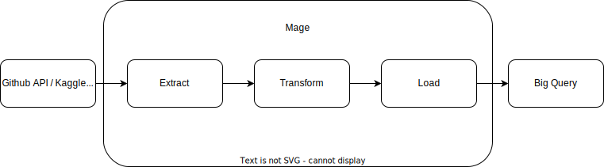

# Architecture

Data is extracted using either Github or Kaggle API, data originates on Kaggle but tidytuesday uploads a copy onto their repo.

The ETL pipeline is run via mage, which can be hosted using any cloud provider. In this practice, it is hosted on Google Compute Engine (GCE), part of Google Cloud Platform (GCP) and the transformed data is stored in a Google BigQuery data warehouse. BigQuery has analytics and dashboards integrated, which will be the downstream use case in this practice.